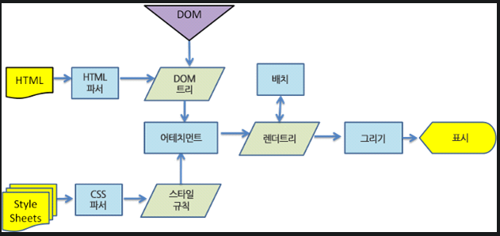

# 🙌 Introduction

이 저장소는 IT창업동아리 CEOS(https://www.ceos.or.kr/) 프론트엔드 팀에서 스터디를 하며 수행한 미션의 결과를 공유합니다.

# 🚩 미션 원문 링크

https://github.com/CEOS-Developers/react-todo-14th

# 🚩 결과물 링크(vercel로 배포)

https://github.com/BonJunKu/react-messenger-14th/friends

# 🚩 미션 목표

- [x] VSCode, Prettier를 이용하여 개발환경을 관리합니다.
- [x] React의 기초를 이해합니다.
- [x] React를 통한 어플리케이션 상태 관리 방법을 이해합니다.
- [x] React Hooks에 대한 기초를 이해합니다.
- [x] Styled-Components를 통한 CSS-in-JS 및 CSS Preprocessor의 사용법을 익힙니다.

# ✔ 필수 요건

- [ ] 1주차 미션의 결과물을 그대로 React로 구현합니다 : 개선할 부분은 개선하고, 불필요한 부분은 제거했습니다. 지난 주 미션에서 필수 요건은 구현했습니다.(아이템 추가,삭제,상태관리 등)
- [x] Functional Components를 사용합니다 : function을 이용해 react component를 이용하고, Hooks로 상태를 관리했습니다.
- [x] React Hooks만을 사용해 상태를 관리합니다 :
      {id, content, state}를 원소로 하는 배열 itemList를 useState로 선언, 관리합니다.
- [x] (이번주는 Redux, MobX, Recoil, SWR등의 외부 상태관리 라이브러리를 사용하지 않아도 미션 수행에 지장이 없습니다.) : 외부라이브러리 사용X

# ✔ 개선된 점

- [x] prettier를 적용했습니다. 사실 지난 주에 제일 처음 한 게 prettier 설정이었는데(...) VSCode상의 `default Formatter`를 설정해주지 않아 prettier가 적용되지 않는 문제가 발생했었습니다.
- [x] 객체에 id를 부여했습니다. 지난 번에는 인덱스로 조작을 했는데, 코드 리뷰를 받으며 아이디 값을 넣을 수 있다는 아이디어를 얻었고, 아이디를 갖는 객체 배열을 조작하였습니다.
- [x] 현재님 코드 리뷰하면서 알게 된 `format` 태그를 이용해서 엔터키로도 입력을 받을 수 있도록 했습니다.
- [x] gihub Pages 대신 vercel을 이용하여 프로젝트를 배포했습니다.
- [x] 자신이 없어서 `==`와 `===`를 섞어서 썼는데, `===`로 다 처리했습니다.(아마도요..?)
- [x] item count를 filter를 이용해 효율적으로 셌습니다.
- [x] 지난 번에는 인라인 스타일링 & 이벤트리스너 떡칠(...)로 스크립트 파일에 스타일링이 많이 되어 있었는데, 이번에는 인라인 스타일링을 최대한 자제하고, 리스너도 따로 만들지는 않고 버튼의 onClick으로 해결했습니다.

## 🤔 Key Questions

### Virtual-DOM은 무엇이고, 이를 사용함으로서 얻는 이점은 무엇인가요?


브라우저는 위의 과정을 거치면서 렌더링을 한다. 쉽게 말해 HTML 파싱, css파싱을 하여 조합 후 렌더링한다. 리액트는 컴포넌트의 state가 변경되면 실제 DOM tree가 아니라 가상의 DOM tree에서 이전의 virtual DOM tree와 비교 후 필요한 부분만 업데이트한다. Virtual DOM tree에 변경 내역을 버퍼링 하는 과정에서 매번 렌더링하는 것보다 효율성이 올라간다. 이때 버퍼링 대상은 '동시'에 변경되는 것에 한한다. Virtual DOM이 무조건 빠른 것은 아니다. 렌더링을 잘 조절해서 최적화를 시켜야 한다. 그리고 메모리 상에 Virtual DOM이 있기 때문에 메모리 사용량이 바닐라에 비해 크다.

### 미션을 진행하면서 느낀, React를 사용함으로서 얻을수 있는 장점은 무엇이었나요?

- 가장 강력한 장점: 컴포넌트의 독립성. 재사용하기 쉽고, 유지 보수하는 데도 용이하다.
- React + styled components로 선택자를 일일이 부여하지 않아도 되는 것은 큰 장점이다. 그런데 컴포넌트 층이 깊어질수록 props로 전달하는 거보다 querySelector로 한 번에 받아오는게 빠를 수도 있겠다는 생각이 들었다.
- Virtual DOM으로 실제 DOM을 조작하는 것에 비해 빠른 속도를 보장한다.
- 인기가 많다고 한다. 문서화가 잘 되어 있고, 커뮤니티도 활발한 편.

### React에서 상태란 무엇이고 어떻게 관리할 수 있을까요?

- state는 컴포넌트가 가지고 있는 속성값이라고 할 수 있다. 자식 노드에게 props의 형태로 물려줄 수 있다.
- 클래스 컴포넌트라면 `this.State`로, 함수형 컴포넌트라면 `useState`로 관리하면 된다.

### Styled-Components 사용 후기 (CSS와 비교)

- 기존 css에 비해 훨씬 가독성이 좋다.(컴포넌트 파일에 같이 포함되어 있어서)

## 😀 로컬 실행방법

`npm start` : 로컬에서 react application을 자동으로 리로드하여 실행시켜줍니다.

## 😀 겪었던 문제들 & 해결 방법:

- npm start/yarn start :

```
yarn add global react-scripts
npm install -g react-scripts

```

- 배열 전달 후 map 사용 불가:
  https://devbirdfeet.tistory.com/47

- vercel로 배포시 빌드 설정 오류:
  https://github.com/vercel/vercel/discussions/5566
